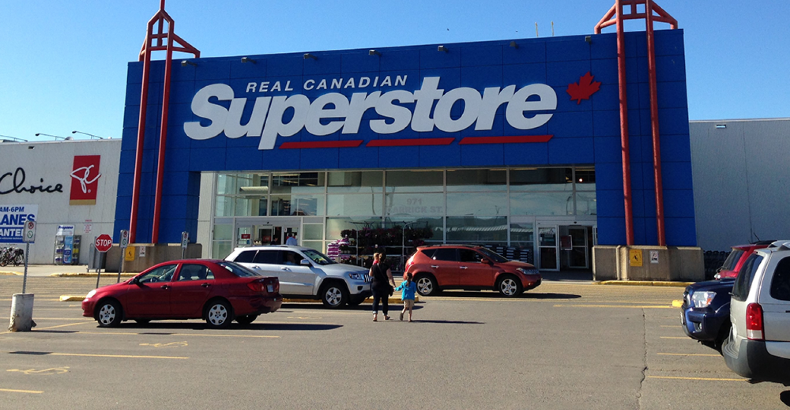
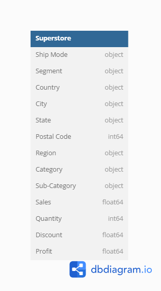

# :european_post_office: Exploratory Data Analysis on Superstore

  <picture>
    
  </picture>

## :books: Table of Contents <!-- omit in toc -->

- [:briefcase: Business Case](#briefcase-business-case)
- [:mag: Entity Relationship Diagram](#mag-entity-relationship-diagram)
- [:bookmark_tabs: Example Datasets](#bookmark_tabs-example-datasets)
- [:triangular_flag_on_post: Questions and Solutions](#triangular_flag_on_post-questions-and-solutions)
  
---

## :briefcase: Business Case

Superstore is a small retail business located in the Canada. Specializing in Furniture, Office Supplies, and Technology products, they cater to a diverse customer base - regular consumers, businesses, and home offices alike.

Superstore maintains a comprehensive dataset covering sales, profits, and customer locations. This wealth of information serves as a valuable tool, shedding light on product preferences, sales trends, and geographical insights.

This case study delves into Superstore's sales data, aiming to uncover patterns of success and areas for growth. By closely examining their data, the goal is to extract insights that can inform strategic decisions and contribute to the store's ongoing success.

View the original publication of the dataset [HERE](https://www.kaggle.com/akashkothare/tsf-datasets).

---

## :mag: Entity Relationship Diagram

  <picture>
    
  </picture>	

---

## :bookmark_tabs: Example Datasets

**Table: superstore**

| Ship Mode      | Segment   | Country       | City            | State      | Postal Code | Region | Category        | Sub-Category | Sales    | Quantity | Discount | Profit   |
|----------------|-----------|---------------|-----------------|------------|-------------|--------|-----------------|--------------|----------|----------|----------|----------|
| Second Class   | Consumer  | United States | Henderson       | Kentucky   | 42420       | South  | Furniture       | Bookcases    | 261.96   | 2        | 0        | 41.9136  |
| Second Class   | Consumer  | United States | Henderson       | Kentucky   | 42420       | South  | Furniture       | Chairs       | 731.94   | 3        | 0        | 219.582  |
| Second Class   | Corporate | United States | Los Angeles     | California | 90036       | West   | Office Supplies | Labels       | 14.62    | 2        | 0        | 6.8714   |
| Standard Class | Consumer  | United States | Fort Lauderdale | Florida    | 33311       | South  | Furniture       | Tables       | 957.5775 | 5        | 0.45     | -383.031 |
| Standard Class | Consumer  | United States | Fort Lauderdale | Florida    | 33311       | South  | Office Supplies | Storage      | 22.368   | 2        | 0.2      | 2.5164   |
| Standard Class | Consumer  | United States | Los Angeles     | California | 90032       | West   | Furniture       | Furnishings  | 48.86    | 7        | 0        | 14.1694  |
| Standard Class | Consumer  | United States | Los Angeles     | California | 90032       | West   | Office Supplies | Art          | 7.28     | 4        | 0        | 1.9656   |
| Standard Class | Consumer  | United States | Los Angeles     | California | 90032       | West   | Technology      | Phones       | 907.152  | 6        | 0.2      | 90.7152  |
| Standard Class | Consumer  | United States | Los Angeles     | California | 90032       | West   | Office Supplies | Binders      | 18.504   | 3        | 0.2      | 5.7825   |

View the CSV dataset [HERE](Dataset/superstore.csv)

---

## :triangular_flag_on_post: Questions and Solutions

### Exploratory Data Insights

1. Which Category is Best Selling and Most Profitable?
2. What are the Best Selling and Most Profitable Sub-Category?
3. Which is the Top Selling Sub-Category?
4. Which Customer Segment is Most Profitable?
5. Which is the Preferred Ship Mode?
6. Which Region is the Most Profitable?
7. Which City has the Highest Number of Sales?

View my solution in:

